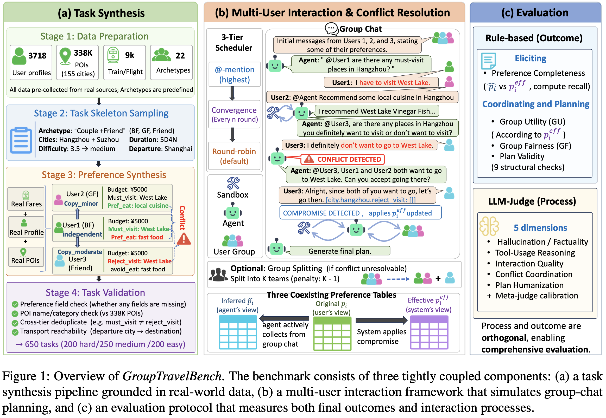

# GroupTravelbench — A Real-World Benchmark for Multi-User Group Travel Planning

## 🌟 Introduction

**GroupTravelbench** is a benchmark for **multi-user group travel planning**. Unlike single-user trip planning, a group itinerary must reconcile **conflicting preferences** (budget, transport, attraction types, and so on) and converge, through **multi-turn interaction**, on a plan that the group as a whole can accept.

The framework runs as a three-way interaction among an **Agent**, a **User simulator**, and a **Tool simulator**. The evaluated Agent talks to a group of users, each with their own preference profile, gathers real information through a travel tool library, identifies and balances competing demands, and finally produces a group itinerary. Rule-based metrics and an LLM-Judge then score the plan along several dimensions.

<div align="center">

</div>

### What We Provide

- **Multi-user scenarios**: 650 tasks, each with several users and their individual preference profiles. The Agent must identify and balance those demands during interaction.
- **Offline sandbox**: about 470K pre-collected real tool-call results ship with the repository. **Evaluation never calls any third-party tool API**, so results are reproducible.
- **Tool library**: 10 travel tools covering geocoding, POI search, route planning, weather, flight/train lookup, and web search.
- **Multi-dimensional evaluation**: group fairness, group utility, plan validity, and preference completeness, combining rule-based scoring with an LLM-Judge.

## 📋 Table of Contents
- [GroupTravelbench — A Real-World Benchmark for Multi-User Group Travel Planning](#grouptravelbench--a-real-world-benchmark-for-multi-user-group-travel-planning)
  - [🌟 Introduction](#-introduction)
    - [What We Provide](#what-we-provide)
  - [📋 Table of Contents](#-table-of-contents)
  - [🔧 Installation](#-installation)
    - [Prerequisites](#prerequisites)
    - [Setup](#setup)
  - [🚀 Quick Start](#-quick-start)
  - [📖 Detailed Usage](#-detailed-usage)
    - [1. Restore Benchmark Data](#1-restore-benchmark-data)
    - [2. Model Configuration](#2-model-configuration)
      - [Option 1: Cloud API (simplest)](#option-1-cloud-api-simplest)
      - [Option 2: Local vLLM](#option-2-local-vllm)
      - [Model roles (what each role needs)](#model-roles-what-each-role-needs)
    - [3. Precompute Embeddings](#3-precompute-embeddings)
    - [4. Run Inference](#4-run-inference)
    - [5. Run Evaluation](#5-run-evaluation)
  - [🧰 CLI Reference](#-cli-reference)
    - [`run` — multi-user conversation (inference)](#run--multi-user-conversation-inference)
    - [`tools` — list available tools](#tools--list-available-tools)
    - [`status` — inspect cache status](#status--inspect-cache-status)
  - [📊 Dataset Format](#-dataset-format)
  - [📁 Project Structure](#-project-structure)
  - [📄 License](#-license)
  - [📖 Citation](#-citation)

## 🔧 Installation

### Prerequisites

- Python 3.10+
- Conda (recommended)
- An OpenAI-compatible API endpoint (cloud service or a local vLLM server)

### Setup

```bash
# Create and activate a conda environment
conda create -n grouptravelbench python=3.10
conda activate grouptravelbench

# Install dependencies
pip install -r requirements.txt
```

Core dependencies are `openai`, `pydantic`, and `numpy`. `faiss-cpu` is optional (speeds up similarity retrieval).
Install `vllm` only if you need to **serve models locally**.

## 🚀 Quick Start

```bash
# 1. Restore evaluation data (required; see the next section)
bash scripts/restore_data.sh

# 2. Edit the global config: model name and API key
vim scripts/base_config.sh

# 3. Optional: serve the Agent model locally (skip this when the Agent runs on a cloud API)
source scripts/base_config.sh && source scripts/vllm_server.sh

# 4. Run the full pipeline (inference → evaluation → report)
bash scripts/run_pipeline.sh --bg
```

> Step 3 is optional only when `USE_CUSTOM_ENDPOINT=false`. With `USE_CUSTOM_ENDPOINT=true`, `run_pipeline.sh` requires `MODEL_SERVICE_URL` and exits with an error if it is missing — it never starts the server for you. Keep steps 3 and 4 in the **same shell** (this is why the server scripts must be `source`d, not `bash`ed): `--bg` snapshots the environment at launch.

The report is written to `eval_output/Agent-{MODEL_NAME}/report.md`.

## 📖 Detailed Usage

All tunables live in `scripts/base_config.sh`. Full script documentation is in [`scripts/README.md`](./scripts/README.md).

### 1. Restore Benchmark Data

The sandbox cache and POI metadata are large (hundreds of MB). Because GitHub rejects files over 100 MB, they are stored as **compressed shards** under [`data_archive/`](./data_archive). After cloning, restore them first:

```bash
bash scripts/restore_data.sh
```

### 2. Model Configuration

Fill in model and API settings in `scripts/base_config.sh`. Every value in that file is a placeholder — replace them with your own.

#### Option 1: Cloud API (simplest)

```bash
export USE_CUSTOM_ENDPOINT=false
export MODEL_NAME="your-model-name"          # Agent model under evaluation
export OPENAI_API_BASE="https://your-api-endpoint/v1"
export OPENAI_API_KEY="your-api-key"
```

If the Agent, User simulator, Tool simulator, or LLM-Judge need different endpoints or keys, override them with `AGENT_API_*`, `USER_API_*`, `TOOL_API_*`, and `LLM_JUDGE_API_*`. Leave a field empty to inherit the global default above.

#### Option 2: Local vLLM

```bash
export USE_CUSTOM_ENDPOINT=true
export MODEL_PATH="/path/to/your/model"

source scripts/base_config.sh
source scripts/vllm_server.sh            # Serve the Agent model; exports MODEL_SERVICE_URL
source scripts/vllm_embedding_server.sh  # Optional: serve the embedding model
```

> You must `source` these scripts (not `bash`) so that `MODEL_SERVICE_URL` is imported into the current shell.
> Deployment logs go to `logs/`.

#### Model roles (what each role needs)

Every role runs on its own model, and they have very different requirements:

| Role | Requirement | This work |s
|------|-------------|-----------|
| Agent (`MODEL_NAME`) | The model under test | — |
| User simulator (`USER_LLM`) | **Must be a strong thinking model.** It has to stay in character, react to the group and know when to compromise; a weak / non-thinking model degrades simulation quality badly. Thinking is ON (`USER_ENABLE_THINKING=true`), and the scripts give it 16384 `max_tokens`. | `DeepSeek-V4-Flash` |
| Tool simulator (`TOOL_LLM`) | Easy role: on a cache miss it only has to simulate a plausible tool response based the retrieved examples, so an instruction-following model is enough and thinking should stay OFF for efficiency(`TOOL_ENABLE_THINKING=false`). | `GPT4.1-0414` |
| LLM-Judge (`LLM_JUDGE_MODEL`) | **Must be a strong thinking model as well**: it reads whole multi-user conversations and has to reason about several dimensions. Thinking is ON (`LLM_JUDGE_ENABLE_THINKING=true`). | `Gemini3-Flash-Preview` |

> Pick the user simulator and the judge with care — they dominate simulation and scoring quality. The tool simulator is the only role where a small non-thinking model is fine.

### 3. Precompute Embeddings

On a cache miss, the Tool simulator retrieves similar historical examples and asks `TOOL_LLM` to invent a response. Retrieval has two modes:

| Mode | Description | Precomputation required |
|------|-------------|-------------------------|
| Random retrieval | Sample examples from the cache at random (default fallback) | No |
| Similarity retrieval | Find the most similar examples via embeddings (higher quality) | Yes |

To enable similarity retrieval, precompute embeddings once:

```bash
source scripts/base_config.sh
source scripts/vllm_embedding_server.sh    # or set EMBEDDING_SERVICE_URL directly
python -m group_travelbench.simulators.precompute_embeddings --cache-dir ./sandbox_cache
```

This writes a `*_embeddings.npz` file next to each `*_cache.json`. If embeddings are missing or no embedding service is configured, the system **falls back to random retrieval** and the pipeline continues.

Both the precompute script and the runtime read the key from `EMBEDDING_API_KEY`. It is optional: a local vLLM ignores the key, so leaving it unset keeps the built-in placeholder; set it only when the embedding service is behind an authenticated gateway.

### 4. Run Inference

```bash
source scripts/base_config.sh
bash scripts/infer.sh
```

- Input: `datas/test.jsonl` (650 tasks)
- Output: `infer_output/Agent-{MODEL_NAME}/test.jsonl`
- Default: 3 trials per task; concurrency is `INFER_MAX_CONCURRENCY`
- **Resume is on by default**: already-finished tasks are skipped. Pass `--no-resume` to rerun everything.

### 5. Run Evaluation

```bash
source scripts/base_config.sh
bash scripts/eval.sh
```

This runs the rule-based metrics (preference completeness / group utility / group fairness / plan validity), the LLM-Judge, and report generation. Outputs land in `eval_output/Agent-{MODEL_NAME}/`:

| File | Contents |
|------|----------|
| `report.md` | Final report (per-dimension scores) |
| `multi_eval_result.json` | Detailed rule-based results |
| `llm_judge_result.json` | Detailed LLM-Judge results |

Pass `--skip-llm-judge` to run only the rule-based metrics (faster, no extra API cost).

## 🧰 CLI Reference

The framework exposes three subcommands via `python -m group_travelbench <command>`.

### `run` — multi-user conversation (inference)

```bash
# Run every entry in a JSONL file
python -m group_travelbench run --file datas/test.jsonl --max-concurrency 4

# Repeat each entry 3 times (independent trials)
python -m group_travelbench run --file datas/test.jsonl --num-trials 3
```

Common arguments:

| Argument | Description | Default |
|----------|-------------|---------|
| `--file` / `--json` | Input source (exactly one required) | — |
| `--agent-llm` | Agent model under evaluation | `gpt-4o` |
| `--user-llm` | User-simulator model | `gpt-4o` |
| `--tool-llm` | Tool-simulator model (cache-miss fallback) | same as `--agent-llm` |
| `--agent-llm-args` | JSON overrides for the Agent config (e.g. `api_base`, `temperature`) | `None` |
| `--max-turn` | Maximum interaction turns | `50` (scripts use `15`) |
| `--convergence-interval` | Turns between convergence summaries | `10` (scripts use `3`) |
| `--max-concurrency` | Max concurrent conversations when reading JSONL | `10` |
| `--num-trials` | Independent repeats per entry | `1` (scripts use `3`) |
| `--sandbox-mode` | Enable the offline sandbox; only `isolated` is supported | `None` |
| `--cache-dir` | Sandbox cache directory | `sandbox_cache` |
| `--output` | Output JSONL path | `multi_user_results.jsonl` |
| `--no-resume` | Disable resume and rerun from scratch | resume on |
| `--debug` | Enable debug logging | off |

> **Resume**: successfully finished tasks (matched by `task_id` + `trial_id`) in the output file are skipped; new results are appended.

### `tools` — list available tools

```bash
python -m group_travelbench tools
```

### `status` — inspect cache status

```bash
python -m group_travelbench status
```

Prints cached and missed entry counts per tool. Use this to confirm that the sandbox was restored completely.

## 📊 Dataset Format

Each line of `datas/test.jsonl` is one task. Core fields:

```jsonc
{
  "task_id": "task_004329",
  "query": "海口市、三亚市、万宁市，七天六夜，3人的旅行计划",
  "time": "2025-09-02",                  // departure date
  "context": "出发城市：长春市；...",      // scenario description
  "metadata": { "departure_city": "...", "cities": [...], "group_name": "..." },
  "user_preferences": {                  // one preference profile per user
    "User1": {
      "role": "男友",                     // persona label used in prompts
      "preference": {
        "global_constraints": { "avg_budget": 6800, "transport": {...}, ... },
        "city_specific_preferences": { "海口市": {...}, "三亚市": {...} }
      },
      "compromisable": true              // whether the user will yield when asked
    }
  },
  "initial_messages": [                  // Phase-1 opening statement per user
    { "role": "User1", "content": "我这边人均不能超过6800元..." }
  ],
  "difficulty_score": 3.5,               // numeric difficulty
  "difficulty_type": "medium"            // easy / medium / hard
}
```

Notes:

- The number of users is dynamic (2, 3, 4, …) and is determined by the keys of `user_preferences`.
- `city_specific_preferences` must be a dict keyed by city name, not a list.
- `initial_messages` is required; every task in the dataset already includes it.

The dataset itself is in Chinese. Tool schemas and tool-side error messages stay in Chinese so they match the data.

## 📁 Project Structure

```
GroupTravelbench/
├── group_travelbench/          # Core Python package
│   ├── __main__.py             # CLI entry (run / tools / status)
│   ├── agents/                 # Group-travel Agent
│   ├── core/                   # Config, dialogue, messages, offline sandbox
│   ├── evaluation/             # Fairness / utility / plan validity / LLM-Judge
│   ├── simulators/             # User / Tool simulators, embedding precompute
│   ├── tools/                  # Tool library (POI, routes, weather, flights/trains)
│   └── utils/                  # Helpers
├── scripts/                    # Deploy and run scripts (see scripts/README.md)
├── datas/                      # Evaluation dataset (test.jsonl, 650 tasks)
├── data_archive/               # Compressed shards (sandbox cache + POI metadata)
├── assets/                     # Figures used in this README
├── requirements.txt
└── README.md
```

## 📄 License

The code is released under the [MIT License](https://opensource.org/license/mit); see [LICENSE](./LICENSE).

The dataset under `datas/` is licensed separately under [CC BY-NC 4.0](https://creativecommons.org/licenses/by-nc/4.0/) (**non-commercial use only**); see [datas/LICENSE](./datas/LICENSE).

The evaluation data shipped under `data_archive/` (the offline tool-call caches and POI metadata restored into `sandbox_cache/` and `poi2category/`) is released under the same [CC BY-NC 4.0](https://creativecommons.org/licenses/by-nc/4.0/) terms as `datas/`.

## 📖 Citation

If you find our paper and resources useful, please consider citing our paper:

```bibtex
@article{cheng2026grouptravelbench,
  title={Grouptravelbench: Benchmarking llm agents on multi-person travel planning},
  author={Cheng, Xiang and Hu, Yulan and Zheng, Lulu and Pan, Zheng and Li, Xin and Liu, Yong},
  journal={arXiv preprint arXiv:2605.25200},
  year={2026}
}
```